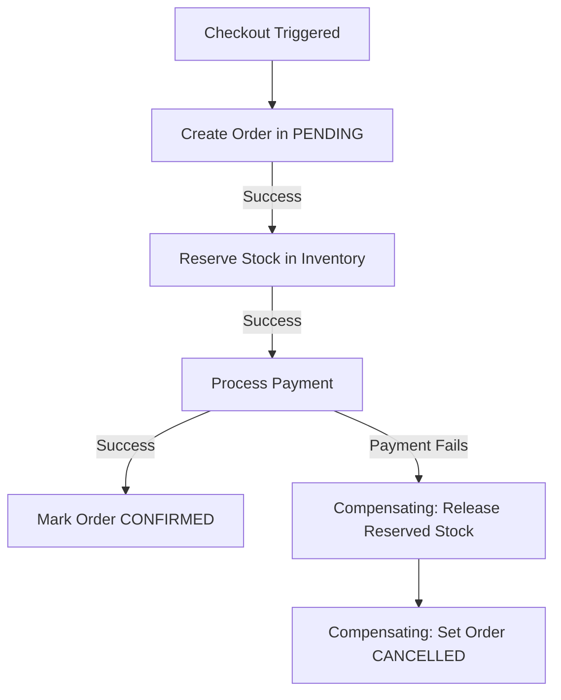

# 🚀 Future Architectural Improvements: Asynchronous Events & Distributed Transactions

This document outlines how to transform our current synchronous microservices communication into a highly scalable, asynchronous, event-driven architecture using **Kafka/RabbitMQ** and distributed transaction patterns (**Saga** and **Transactional Outbox**).

---

## 1. Asynchronous Event-Driven Communication (Kafka/RabbitMQ)

Currently, services communicate synchronously using OpenFeign. While this works well for critical real-time operations (like stock reservation), it blocks threads for non-blocking actions like sending emails or notifications.

### How to Implement Message Brokers (e.g., Apache Kafka):

#### Step 1: Add Spring Kafka Dependency
Add this to the `pom.xml` of the services that need to send or listen to events:
```xml
<dependency>
    <groupId>org.springframework.kafka</groupId>
    <artifactId>spring-kafka</artifactId>
</dependency>
```

#### Step 2: Configure Kafka Properties (`application.yml`)
```yaml
spring:
  kafka:
    bootstrap-servers: localhost:9092
    producer:
      key-serializer: org.apache.kafka.common.serialization.StringSerializer
      value-serializer: org.springframework.kafka.support.serializer.JsonSerializer
    consumer:
      group-id: notification-group
      key-deserializer: org.apache.kafka.common.serialization.StringDeserializer
      value-deserializer: org.springframework.kafka.support.serializer.JsonDeserializer
      properties:
        spring.json.trusted.packages: "com.substring.easybuy.dto"
```

#### Step 3: Publish an Event (Producer in Cart-Order Service)
When an order is successfully checked out, write to a Kafka topic instead of calling other services synchronously:
```java
@Autowired
private KafkaTemplate<String, OrderEvent> kafkaTemplate;

public void placeOrder(Order order) {
    OrderEvent event = new OrderEvent(order.getId(), order.getUserId(), "ORDER_PLACED");
    kafkaTemplate.send("order-events", event);
}
```

#### Step 4: Listen to the Event (Consumer in Notifications Service)
```java
@KafkaListener(topics = "order-events", groupId = "notification-group")
public void handleOrderEvent(OrderEvent event) {
    // Send email/SMS asynchronously without blocking the checkout thread
    emailService.sendOrderConfirmation(event.getUserId(), event.getOrderId());
}
```

---

## 2. Managing Distributed Transactions (Saga Pattern)

In a microservice system, every service has its own database. If checkout succeeds but inventory deduction or payment fails, we must rollback updates across all services. The **Saga Pattern** manages this using local transactions and compensating actions.



### Choreography-Based Saga (Event-Driven)
1. **Cart-Order Service** saves order as `PENDING` and publishes `OrderCreatedEvent`.
2. **Inventory Service** listens to `OrderCreatedEvent`, reserves stock, and publishes `StockReservedEvent` (or `StockReservationFailedEvent`).
3. **Payment Service** listens to `StockReservedEvent`, processes payment, and publishes `PaymentCompletedEvent` (or `PaymentFailedEvent`).
4. **Rollback (Compensating Actions)**: If payment fails, Payment Service publishes `PaymentFailedEvent`. Both Inventory and Order services listen to this event:
   * Inventory Service releases the reserved stock.
   * Cart-Order Service changes the order status to `CANCELLED`.

---

## 3. Transactional Outbox Pattern

When combining database updates and message publishing (e.g., saving an order to MySQL and sending a message to Kafka), network failures can cause data mismatch:
* The database transaction commits, but Kafka is down (message is lost).
* Kafka receives the message, but the database transaction rolls back.

### The Solution:
Instead of sending messages directly to Kafka during business logic:
1. Save the business record (e.g., `Order`) **and** an event record (e.g., `OutboxEvent`) into the **same database** in a single transaction.
2. A background worker (using a tool like **Debezium** or a custom Spring Scheduler) continuously polls the `outbox` table and pushes events to Kafka.
3. Once pushed successfully, the worker marks the event as `PROCESSED`.

```
  ┌────────────────────────────────────────────────────────┐
  │              SPRING BOOT APPLICATION                   │
  │                                                        │
  │  ┌───────────────┐               ┌──────────────────┐  │
  │  │  Save Order   ├──────────────►│ Save OutboxEvent │  │
  │  └───────┬───────┘ (Transaction) └────────┬─────────┘  │
  └──────────┼────────────────────────────────┼────────────┘
             │                                │
             ▼                                ▼
     ┌───────────────┐                ┌───────────────┐
     │  Orders Table │                │ Outbox Table  │
     └───────────────┘                └───────┬───────┘
                                              │
                                              ▼ (Polling / CDC)
                                      ┌───────────────┐
                                      │ Kafka Broker  │
                                      └───────────────┘
```

---

## 💡 Summary Path Forward
When implementing these:
1. Start by installing **Apache Kafka** or a light cloud-hosted queue.
2. Migrating **Notifications Service** to Kafka Consumers is the easiest and highest-reward first step.
3. Keep the **Cart-Order** to **Inventory** reservation synchronous using Feign clients first, and then transition to a Saga orchestration model as transaction volume grows.
