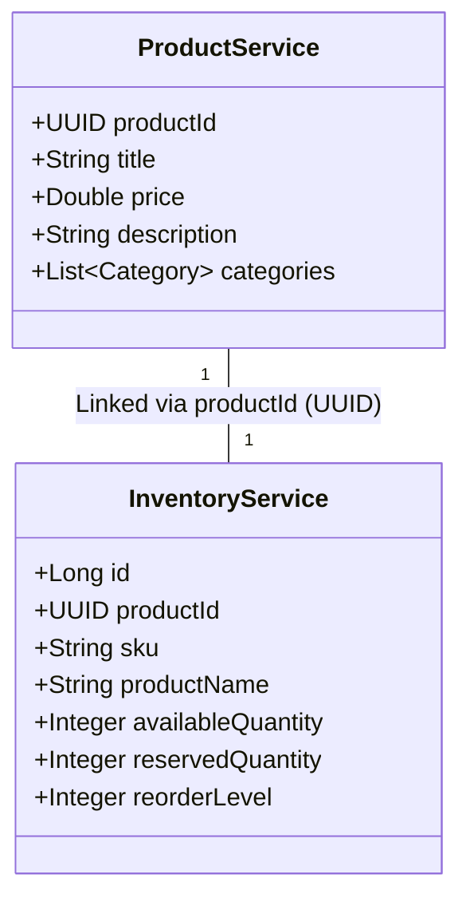
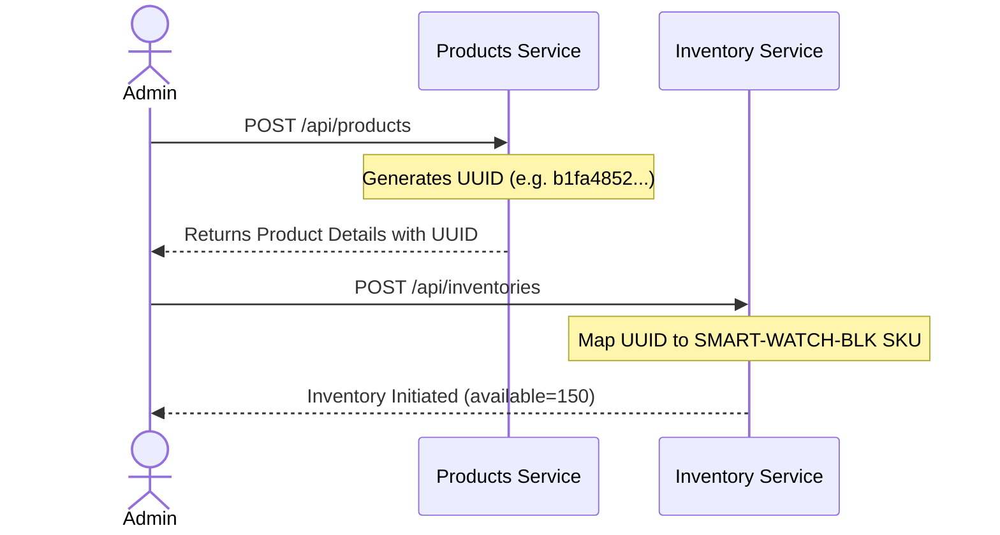
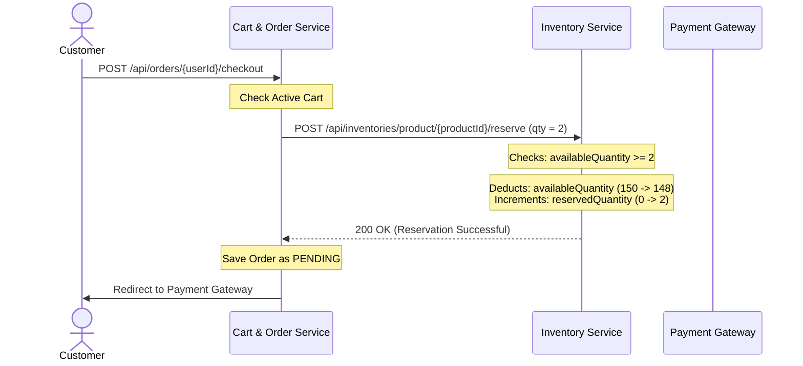
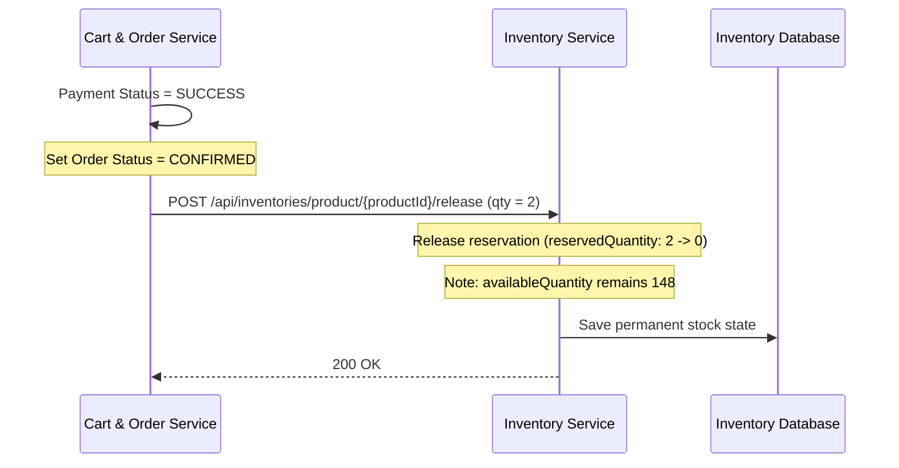
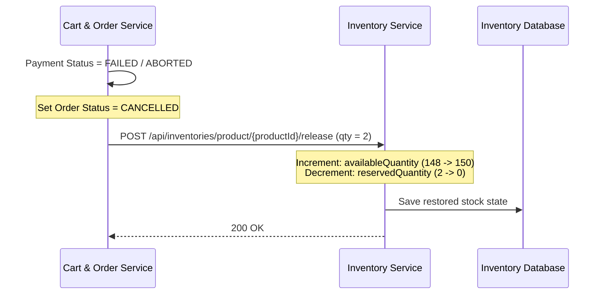

# 📦 Easy Buy Inventory Management Architecture

This document provides a detailed explanation of the linkage and dynamic operations between the **Products Service** and the **Inventory Service** within the Easy Buy e-commerce platform.

---

## 1. Architectural Linkage Model

In a distributed microservice environment, the catalog database and the inventory database are decoupled. They synchronize and link through a single unique identifier: the **`productId` (UUID)**.



### 💡 Why store `productName` in both services?
The inventory service stores the `productName` locally (**database denormalization**) to achieve:
1. **Low Latency**: Queries like checking low-stock alerts (`GET /api/inventories/low-stock`) do not need to make synchronous REST calls to `products-service` to show the names of the flagged items.
2. **Service Autonomy**: Warehouse operators can manage stock, check locations, and handle items even if the product catalog service is offline.
3. **Audit Trails**: It keeps a snapshot of the item's name as it was labeled when cataloged in inventory.

---

## 2. Inventory State Variables
The inventory service maintains three critical quantity fields for every product SKU:

$$\text{Total Physical Stock} = \text{availableQuantity} + \text{reservedQuantity}$$

* **`availableQuantity`**: Units physically present on shelves that are **available for new purchases**.
* **`reservedQuantity`**: Units claimed by customers currently checking out. They are **withheld from the public catalog** to prevent double-selling but are not yet shipped.
* **`reorderLevel`**: Threshold quantity. If `availableQuantity` falls below this value, the system triggers alerts for replenishment.

---

## 3. Dynamic Workflow Lifecycle

### Flow A: Registering a New Product
When a catalog admin creates a product, the inventory record must be initialized:



---

### Flow B: Checkout & Stock Reservation
When a customer initiates checkout, stock is temporarily reserved to ensure a smooth transition to payment without stock stealing.



---

### Flow C: Complete Transaction (Payment Success)
If the customer successfully pays, the reserved stock is officially committed and subtracted from physical inventory.



---

### Flow D: Transaction Rollback (Payment Fails or Order Cancelled)
If payment fails, or the customer decides to abort the purchase, the reserved stock is returned to the public pool.



---

## 4. Concurrent Order Protection (Race Conditions)

Because the database reservation check uses transactional isolation (`@Transactional`), the database prevents **double selling** (over-allocation of stock):

```sql
-- Conceptual Query executed under isolation during reservation
SELECT available_quantity, reserved_quantity 
FROM inventory_items 
WHERE product_id = :productId FOR UPDATE;
```

If two transactions try to reserve the last `1` remaining item simultaneously:
1. Transaction A locks the row and finds `available_quantity = 1`. It updates `available_quantity = 0` and `reserved_quantity = 1`.
2. Transaction B blocks until Transaction A releases the row lock.
3. Once A releases the lock, Transaction B reads the updated row: `available_quantity = 0`.
4. Transaction B fails with `BusinessRuleException: Insufficient stock` and rolls back, ensuring the system never over-commits stock.
