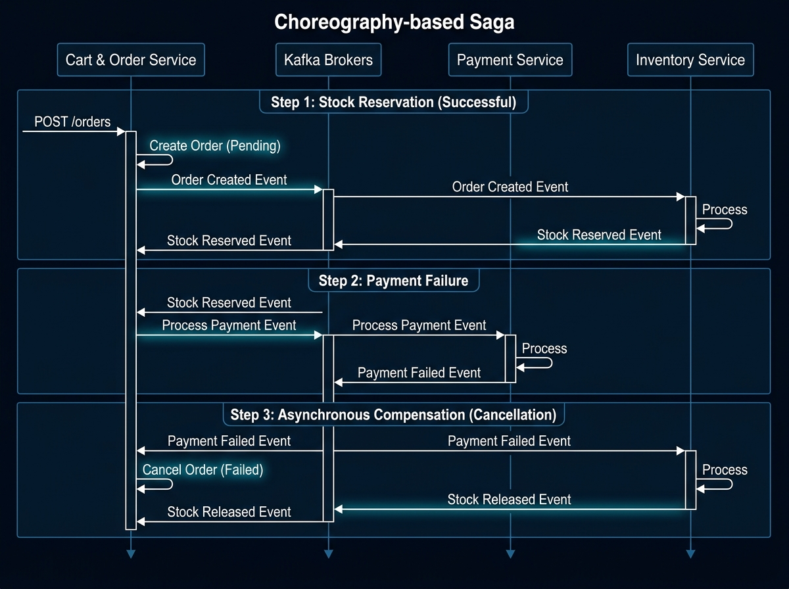
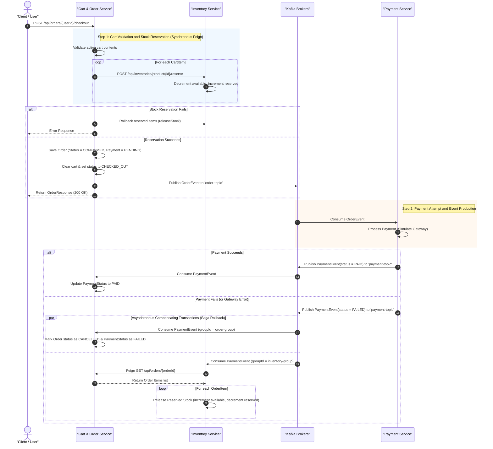

# 📖 Order Checkout & Choreography-Based Saga Pattern

This document details the complete flow of an **Order Checkout** request in Easy Buy and explains how a decentralized, event-driven **Choreography-based Saga Pattern** maintains eventual data consistency across microservices if a payment failure occurs.

---

## 🗺️ Architectural Sequence Diagram

The following sequence diagram outlines the asynchronous event transitions across our microservices after checkout is triggered:

---

## 🔄 Lifecycle of a Checkout Request

### Phase 1: Checkout Initiation (Synchronous)
1. The user triggers checkout by sending a payload to `POST /api/orders/{userId}/checkout`.
2. The [OrderController.java](file:///D:/Live%20Batches/micro_devops/easy_busy/cart-order-service/cart-order-service/src/main/java/com/substring/easybuy/cart_order/controller/OrderController.java) receives the request and calls [OrderServiceImpl.java](file:///D:/Live%20Batches/micro_devops/easy_busy/cart-order-service/cart-order-service/src/main/java/com/substring/easybuy/cart_order/service/OrderServiceImpl.java).
3. The active cart is retrieved. For each item in the cart, a synchronous Feign HTTP request is sent to `inventory-service` to reserve the stock. 
4. If reservation succeeds, a local transaction saves the order with `PaymentStatus.PENDING` and `OrderStatus.CONFIRMED`, and the cart is marked `CHECKED_OUT`.
5. An `OrderEvent` is published to the `"order-topic"` Kafka topic via [OrderEventPublisher.java](file:///D:/Live%20Batches/micro_devops/easy_busy/cart-order-service/cart-order-service/src/main/java/com/substring/easybuy/cart_order/producer/OrderEventPublisher.java).

### Phase 2: Asynchronous Payment Processing
1. The `payment-service` consumes the `OrderEvent` via [OrderEventConsumer.java](file:///D:/Live%20Batches/micro_devops/easy_busy/payment-service/payment-service/src/main/java/com/substring/easybuy/payments/consumer/OrderEventConsumer.java).
2. The payment is processed in [PaymentServiceImpl.java](file:///D:/Live%20Batches/micro_devops/easy_busy/payment-service/payment-service/src/main/java/com/substring/easybuy/payments/service/PaymentServiceImpl.java).
3. If payment succeeds, a `PaymentEvent` is published to `"payment-topic"` with `status = "PAID"`.
4. If payment fails (e.g. gateway decline or simulation card), a `PaymentEvent` is published to `"payment-topic"` with `status = "FAILED"`.

### Phase 3: The Saga Compensating Flow (Decoupled Rollback)
When payment fails, the Saga choreography is triggered. Two microservices subscribe to the `"payment-topic"` and run compensating transactions independently:

#### 1. Cart & Order Service Rollback
* **Consumer**: [PaymentEventConsumer.java](file:///D:/Live%20Batches/micro_devops/easy_busy/cart-order-service/cart-order-service/src/main/java/com/substring/easybuy/cart_order/consumer/PaymentEventConsumer.java)
* **Local Transaction**: The service updates the order payment status to `FAILED`, changes the order status to `CANCELLED`, and logs the cancellation timestamp.

#### 2. Inventory Service Rollback
* **Consumer**: [PaymentEventConsumer.java](file:///D:/Live%20Batches/micro_devops/easy_busy/inventory-service/inventory-service/src/main/java/com/substring/easybuy/inventory/consumer/PaymentEventConsumer.java)
* **Local Transaction**: The service fetches the original order details via Feign ([OrderClient.java](file:///D:/Live%20Batches/micro_devops/easy_busy/inventory-service/inventory-service/src/main/java/com/substring/easybuy/inventory/external/OrderClient.java)) to verify items and quantities, then updates each item's stock in [InventoryServiceImpl.java](file:///D:/Live%20Batches/micro_devops/easy_busy/inventory-service/inventory-service/src/main/java/com/substring/easybuy/inventory/service/InventoryServiceImpl.java) by adding back the quantities to `availableQuantity` and subtracting from `reservedQuantity`.

---

## 🛠️ Code Reference Map

* **Checkout & Order Creation**:
  * [OrderController.checkout()](file:///D:/Live%20Batches/micro_devops/easy_busy/cart-order-service/cart-order-service/src/main/java/com/substring/easybuy/cart_order/controller/OrderController.java#L32-L35)
  * [OrderServiceImpl.checkout()](file:///D:/Live%20Batches/micro_devops/easy_busy/cart-order-service/cart-order-service/src/main/java/com/substring/easybuy/cart_order/service/OrderServiceImpl.java#L142-L199)
* **Kafka Producers**:
  * [OrderEventPublisher.publishOrderCreatedEvent()](file:///D:/Live%20Batches/micro_devops/easy_busy/cart-order-service/cart-order-service/src/main/java/com/substring/easybuy/cart_order/producer/OrderEventPublisher.java#L23-L32)
  * [PaymentEventPublisher.publishPaymentEvent()](file:///D:/Live%20Batches/micro_devops/easy_busy/payment-service/payment-service/src/main/java/com/substring/easybuy/payments/producer/PaymentEventPublisher.java#L19-L27)
* **Kafka Consumers (Saga Handlers)**:
  * [OrderEventConsumer.consumeOrderCreatedEvent()](file:///D:/Live%20Batches/micro_devops/easy_busy/payment-service/payment-service/src/main/java/com/substring/easybuy/payments/consumer/OrderEventConsumer.java#L36-L79)
  * [PaymentEventConsumer.consumePaymentEvent() (Order Service)](file:///D:/Live%20Batches/micro_devops/easy_busy/cart-order-service/cart-order-service/src/main/java/com/substring/easybuy/cart_order/consumer/PaymentEventConsumer.java#L19-L36)
  * [PaymentEventConsumer.consumePaymentEvent() (Inventory Service)](file:///D:/Live%20Batches/micro_devops/easy_busy/inventory-service/inventory-service/src/main/java/com/substring/easybuy/inventory/consumer/PaymentEventConsumer.java#L20-L55)
